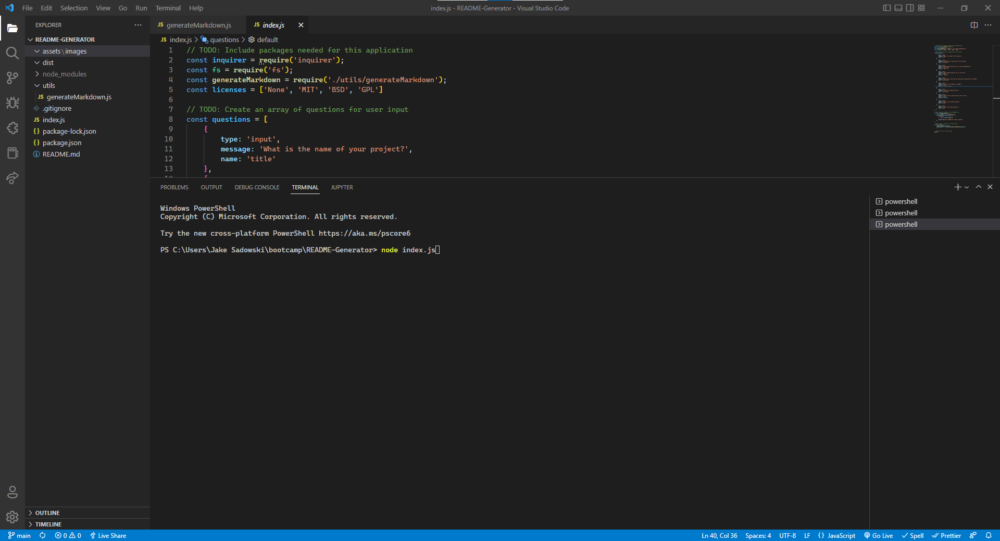

# Module 09 README Generator

## Table of Contents
1. [Description](#description)
2. [Installation](#installation)
3. [Testing](#testing)
4. [Contribution](#contribution)
5. [Mock-Up](#mock-Up)
6. [Application](#application)
7. [License](#license)
8. [Contact](#contact)

## Description
This is a command-line application that dynamically generates a professional README.md file from a user's input using the Inquirer package. Using the terminal, the user will input the necessary information about their project into the prompted questions in the terminal. Once complete a README.md file will be generated in the ./dist folder and can be pushed up to the repo. This app was developed during the node.js module of the UTA Bootcamp.

## Installation
N/A

## Testing
N/A

## Video Demo
[Link-To-Demo] https://drive.google.com/file/d/1v28cyk85DOjzfdJw2y5ATlQ8491BaVW9/view 

## Mock-Up

## License
Please see https://mit-license.org/ to get info about this license

## Contact
Email: jasadowski7@gmail.com
GitHub: jsadowski7
